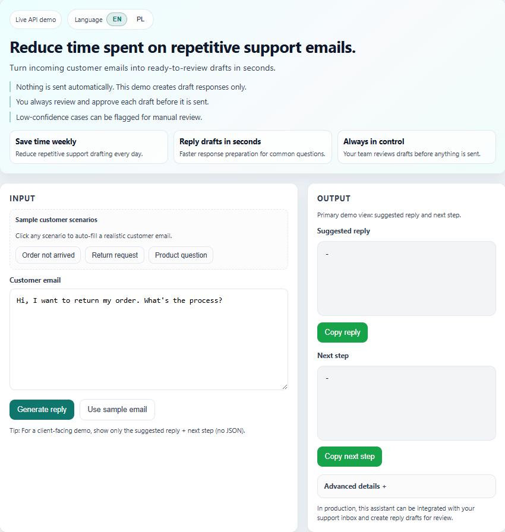

# AI Automation & Data Analytics Portfolio

Public portfolio of practical projects in **AI automation, backend workflows, SQL analytics, and data analysis**.

I build tools that solve real business problems such as:

- reducing repetitive customer support work,
- preparing AI-generated draft replies,
- automating outreach workflows,
- transforming raw data into KPI-ready analytics.

This repository is focused on **real-world use cases**, not tutorial-style toy projects.

---

## Featured Projects

### 1) AI Email Support Assistant
**Folder:** `projects/03-ai-support-agent`  
**Live demo:** https://ai-automation-portfolio-tyou.onrender.com/demo

A production-oriented AI support workflow that helps businesses handle repetitive customer emails faster.

**What it does:**
- classifies customer intent (shipping, returns, refunds, order status, etc.),
- generates ready-to-review draft replies,
- suggests the next internal step,
- supports multilingual replies,
- creates Gmail drafts instead of auto-sending,
- logs requests for debugging, monitoring, and auditing.

**Tech:** FastAPI, OpenAI API, SQLite, Gmail API, Pydantic

**Why it matters:**  
This project shows how AI can be used safely in a real support workflow while keeping a human in control through a **draft-first** approach.

---

### 2) Outreach Assistant
**Folder:** `projects/03.5-outreach-assistant`

A draft-first outreach automation system that imports leads from Google Sheets, processes them locally in SQLite, prepares outreach drafts, handles duplicate detection, and syncs results back into the sheet.

**What it does:**
- imports leads from Google Sheets,
- classifies rows into outreach-ready / follow-up / review states,
- generates Gmail drafts only (no auto-send),
- detects hard and soft duplicates,
- preserves human notes and responses,
- syncs assistant outputs back to the sheet.

**Tech:** Python, SQLite, Google Sheets API, Gmail API, pytest

**Why it matters:**  
This project is close to a real sales operations workflow. It focuses on speed, control, and safety rather than blind automation.

---

### 3) SQL Sales Dashboard Backend
**Folder:** `projects/02-sql-dashboard`

A SQL analytics backend built on the Brazilian E-Commerce Public Dataset by Olist.

**What it includes:**
- relational PostgreSQL schema,
- SQL views for analytics and BI-style reporting,
- KPI queries for revenue trends and AOV,
- sample outputs and schema diagram.

**Key business outputs:**
- daily and monthly revenue trends,
- top revenue days,
- average order value analysis,
- dashboard-ready semantic layer.

**Tech:** SQL, PostgreSQL, data modeling

---

### 4) Email Automation
**Folder:** `projects/01-email-automation`

A Python-based email automation project focused on structured processing and automation-ready outputs.

**What it demonstrates:**
- email workflow automation,
- structured data extraction,
- secure config with environment variables,
- clean project organization for reusable automation logic.

**Tech:** Python, SMTP, `.env` configuration

---

### 5) Data Analytics Notebooks
**Folder:** `projects/04-data-analytics`

A structured analytics project built around business-oriented analysis in Jupyter notebooks.

**What it includes:**
- data exploration and cleaning,
- filtering, groupby, and pivot tables,
- business insights and executive-style conclusions,
- notebook-based storytelling with analysis.

**Tech:** Python, pandas, numpy, Jupyter

---

## Tech Stack

- Python
- FastAPI
- SQL / PostgreSQL / SQLite
- pandas / numpy
- Jupyter Notebooks
- OpenAI API / LLM workflows
- Gmail API / Google Sheets API
- Automation workflows
- Git / GitHub
- Make.com / Zapier

---

## What This Portfolio Shows

This repository documents my progress toward becoming an **AI Automation Specialist & Data Analyst** by building practical, portfolio-ready systems.

Across these projects, I focus on:

- backend-first AI workflows,
- business process automation,
- draft-first human-in-the-loop systems,
- analytics-ready data modeling,
- turning raw inputs into usable business outputs.

---

## Current Focus

My strongest current direction is building **AI-powered workflow tools for small businesses**, especially in areas like:

- customer support automation,
- outreach workflow automation,
- internal productivity tools,
- data-backed operational reporting.

---

## About Me

I am building this portfolio in public to demonstrate practical, job-ready and client-ready skills in:

- AI automation,
- backend workflows,
- applied analytics,
- business-focused problem solving.

My goal is to help businesses save time, reduce repetitive work, and use AI in ways that are practical, controlled, and useful.

---

## Contact

- **LinkedIn:** https://www.linkedin.com/in/adam-siwonia-059bb03a0
- **Email:** adam.pawel.siwonia@gmail.com